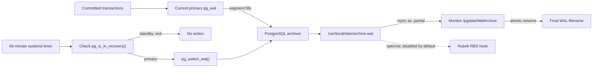
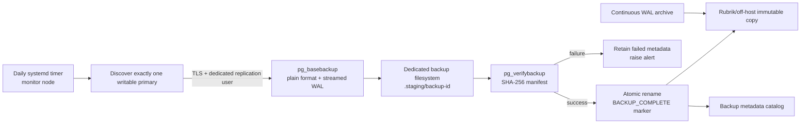

# PostgreSQL 18 Backup and Database Recovery Runbook

## 1. Purpose and scope

This runbook explains the backup controls implemented by this repository and
provides recovery procedures for the QMS PostgreSQL 18 HA environments. It is
intended for database, infrastructure, backup, and incident-response teams.

It covers:

- continuous WAL archiving to the monitor/archive node;
- the 60-minute forced WAL-switch schedule;
- backup health verification;
- recovery of an intact database node;
- rebuilding a failed or replaced data node;
- recovery from a VM backup;
- pg_auto_failover monitor recovery;
- point-in-time recovery (PITR);
- total database-tier recovery.

This document does not authorize deletion, formatting, forced promotion, or
data-loss operations. Destructive recovery requires an approved change,
verified backups, VMware fencing, and a PostgreSQL/pg_auto_failover specialist.

## 2. Environment reference

| Environment | Data node 1 | Data node 2 | Monitor/archive | VIP |
|---|---|---|---|---|
| UAT | `BHC-QMSSQLU05` / `192.168.129.105` | `BHC-QMSSQLU06` / `192.168.129.106` | `BHC-QMSSQLU07` / `192.168.129.107` | `192.168.129.110` |
| Production | `BHC-QMSSQLP01.bayshore.ca` / `192.168.128.134` | `BHC-QMSSQLP02.bayshore.ca` / `192.168.128.135` | `BHC-QMSSQLP03.bayshore.ca` / `192.168.128.136` | `PGBQMSLSP01` / `192.168.128.139` |

Common paths:

```text
/pgdata/pgroot                 XFS data filesystem root
/pgdata/pgroot/data            PostgreSQL PGDATA
/pgdata/pgroot/backup          pg_autoctl standby bootstrap staging
/pgdata/wal                    dedicated WAL filesystem
/pgdata/pgroot/data/pg_wal     bind mount of /pgdata/wal
/pgdata/WalArchive             archive location on the monitor node
```

Select the environment explicitly on the Ansible control server:

```bash
export INVENTORY="$PWD/inventories/uat_hosts.ini"
# Production:
# export INVENTORY="$PWD/inventories/prod_hosts.ini"

export PGDATA=/pgdata/pgroot/data
export PGROOT=/pgdata/pgroot
export PGWAL=/pgdata/wal
```

Never rely on a test wrapper's default inventory during a Production incident.

## 3. What is backed up now

### 3.1 Protection layers

| Layer | Purpose | Current implementation |
|---|---|---|
| Synchronous streaming replication | HA and rapid node failover | pg_auto_failover data-node pair |
| Continuous WAL archive | Retains completed database change history | `archive_command` over SSH/rsync to monitor |
| Hourly partial-segment closure | Bounds age of a low-volume open WAL segment | systemd timer on both data nodes |
| Standby base backup | Creates/recreates an HA secondary | pg_autoctl invokes `pg_basebackup` during node creation |
| Retained recovery base backup | Starting point for PITR/total restore | Target design in Section 5.4; implementation and backup-owner approval pending |
| Configuration recovery | Recreates OS, PostgreSQL, routing, and archive configuration | Ansible repository and Vault variables |

### 3.2 Critical distinction

Replication is not a backup. It reproduces accidental deletes and logical
corruption on the standby.

Archived WAL is also not a complete backup. PITR requires:

1. a compatible physical base backup;
2. every required WAL segment and timeline-history file from that backup to
   the requested recovery point;
3. PostgreSQL configuration, secrets, roles, networking, and storage layout;
4. a tested restoration procedure.

The `pg_basebackup` used to create a standby is temporary HA bootstrap data. It
is not catalogued or retained by this repository as a disaster-recovery backup.

The Rubrik hook is disabled by default. Until the backup team confirms an
application-consistent base-backup policy and successful restore test, the
platform has WAL archival but not a complete, proven PITR service.

The monitor archive is separate from the two data nodes, but it is not an
off-site or immutable copy. Loss or corruption of the monitor archive disk can
break the recovery chain unless Rubrik or another system has copied it to an
independent protected location.

## 4. Detailed WAL backup process



### 4.1 PostgreSQL archive configuration

The role deploys:

```text
wal_level = replica
archive_mode = on
archive_command = '/usr/local/sbin/archive-wal "%p" "%f"'
archive_timeout = '3600s'
```

PostgreSQL invokes `archive_command` only for completed WAL segments. A full
segment is archived immediately; it does not wait for the hourly timer.

`archive_timeout=3600s` requests a segment switch after an hour of relevant
activity when a partial segment remains open. The separate systemd timer also
calls `pg_switch_wal()` every 60 minutes on the current primary.

The timer is installed on both data candidates because their primary/standby
roles can change. `/usr/local/sbin/force-wal-archive`:

1. obtains an exclusive lock to prevent overlapping executions;
2. connects locally as the `postgres` operating-system account;
3. checks `pg_is_in_recovery()`;
4. exits successfully when the node is a standby;
5. records the current WAL filename;
6. calls `pg_switch_wal()` on the primary;
7. records the request in the system journal.

If no WAL activity occurred since the previous switch, PostgreSQL may have no
new segment to archive. That is normal because there are no new changes to
protect.

### 4.2 Archive transport

For every completed segment, `/usr/local/sbin/archive-wal`:

1. uses the node's dedicated Ed25519 key;
2. checks whether the final filename already exists on the monitor;
3. transfers the source with rsync as `<WAL>.partial`;
4. atomically renames the partial file to the final WAL filename;
5. optionally invokes the Rubrik hook;
6. returns success to PostgreSQL only after transport completes.

The current archive layout is a single directory. Before introducing a newly
initialized PostgreSQL system identifier, preserve the old archive and assign
a new approved archive namespace. A new cluster must not silently treat a WAL
filename left by a different system identifier as its own.

The key is restricted to its originating data-node IP. The monitor's
`postgres` account is a member of the dedicated `postgres-wal-ssh` SSH group,
and the archive directory is owned by `postgres:postgres` with mode `0750`.

If the helper returns nonzero, PostgreSQL retries the segment. It retains
unarchived WAL in the WAL filesystem. Continued failure can fill `/pgdata/wal`
and eventually stop PostgreSQL, so archive failures require urgent action.

### 4.3 Recovery-point implications

The hourly switch is an upper-bound objective, not a guaranteed RPO. Actual
recoverability depends on:

- successful archive transport;
- an unbroken WAL sequence;
- the age and validity of the retained base backup;
- the last segment safely copied off the monitor/archive failure domain;
- the selected recovery target and restore test results.

Busy systems normally complete and archive segments more frequently than once
an hour. Low-volume systems can have up to approximately one hour of committed
changes in an open segment before the forced switch. A monitor or network
failure can increase that exposure.

## 5. Backup operating procedure

### 5.1 Daily checks

Run from the control server:

```bash
ansible db_primary:db_standby -i "$INVENTORY" -b -m shell \
  -a "systemctl is-active postgresql-wal-archive-hourly.timer; \
      systemctl list-timers postgresql-wal-archive-hourly.timer --no-pager"

ansible db_primary:db_standby -i "$INVENTORY" -b \
  --become-user postgres -m shell \
  -a "psql -X -At -d postgres -c \
      \"SELECT pg_is_in_recovery(), archived_count, failed_count, \
      last_archived_wal, last_archived_time, last_failed_wal, \
      last_failed_time FROM pg_stat_archiver;\""

ansible db_monitor -i "$INVENTORY" -b -m shell \
  -a "findmnt /pgdata/WalArchive; df -hT /pgdata/WalArchive; \
      find /pgdata/WalArchive -maxdepth 1 -type f -printf '%TY-%Tm-%Td %TH:%TM %f\n' \
      | sort | tail -10"

ansible db_primary:db_standby -i "$INVENTORY" -b -m shell \
  -a "findmnt '$PGDATA/pg_wal'; df -hT '$PGWAL'; \
      journalctl -u postgresql-wal-archive-hourly.service -n 10 --no-pager"
```

Expected results:

- the timer is `active` and has a future trigger time;
- exactly one data node reports `pg_is_in_recovery() = false`;
- `failed_count` is not increasing;
- `last_archived_time` advances when WAL is generated;
- the monitor archive and data-node WAL filesystems have adequate free space;
- no `.partial` file remains indefinitely.

### 5.2 Controlled archive test

Use the repository test:

```bash
bash tests/run_wal_archive_test.sh --ask-vault-pass
```

This requires typed confirmation, discovers the current primary, forces one
WAL switch, and waits for the exact segment on the monitor.

Manual alternative during an approved test:

```bash
sudo systemctl start postgresql-wal-archive-hourly.service
sudo -u postgres psql -X -d postgres -c \
  "SELECT archived_count, failed_count, last_archived_wal, last_archived_time, \
          last_failed_wal, last_failed_time FROM pg_stat_archiver;"
```

On the monitor:

```bash
sudo -u postgres ls -lht /pgdata/WalArchive | head
```

### 5.3 Base-backup control

The backup team must record for every retained physical backup:

- backup product and job ID;
- source node and whether it was primary or standby;
- PostgreSQL major version;
- database system identifier;
- backup start/end UTC timestamps;
- starting and ending WAL/timeline information;
- backup manifest and verification result when available;
- storage location, encryption, retention, and immutability;
- earliest and latest retained WAL required by that backup;
- last successful isolated restore test.

For PostgreSQL-native backups, retain and validate the `backup_manifest` with
`pg_verifybackup`. Do not delete WAL solely by file age; retention must preserve
the chain needed by every retained base backup.

### 5.4 Designed physical base-backup solution

This section defines the target design. It is not considered operational until
the additional storage/repository, dedicated credential, Ansible automation,
monitoring, Rubrik policy, and isolated restore test have all been completed.

#### 5.4.1 Objectives

The solution must:

- create a recoverable PostgreSQL 18 physical base backup every day;
- discover the current primary dynamically after pg_auto_failover promotion;
- include the WAL required to start the base backup independently;
- preserve subsequent archived WAL for PITR;
- verify every backup before publishing it as complete;
- prevent a failed or partial backup from appearing valid;
- copy completed backups and WAL to an independent protected repository;
- prevent a base-backup job from filling the WAL archive filesystem;
- retain enough history to meet the approved RPO, RTO, and retention policy;
- provide alerting and a quarterly isolated restore test.

#### 5.4.2 Architecture



The scheduled job runs on the monitor/backup node rather than on both data
nodes. It connects to both candidates, runs a read-only recovery-state query,
and continues only when exactly one node reports
`pg_is_in_recovery() = false`. Zero or two writable candidates is an incident;
the job must fail without taking a backup.

#### 5.4.3 Storage design

Preferred design:

```text
/pgdata/WalArchive       existing dedicated WAL archive filesystem
/pgdata/BaseBackups      new dedicated XFS filesystem or protected backup mount
```

Do not place routine base backups on the PostgreSQL data LVs. A base-backup
failure must not consume database data or WAL capacity.

The existing Production 405 GB archive disk is already the WAL recovery-chain
target. Storing multiple full backups on that same filesystem creates a common
capacity failure and is not the preferred Production design. Provision a
separate virtual disk/datastore-backed XFS filesystem or a Rubrik-supported
backup target for `/pgdata/BaseBackups`.

Size the filesystem using:

```text
required capacity =
  (maximum physical cluster size × local full-backup count)
  + maximum backup staging size
  + restore-test workspace, when local
  + 20% operational headroom
```

For a cluster that can reach 100 GB, two published local full backups plus one
in-progress backup already require approximately 300 GB before headroom. A
minimum 400 GB dedicated base-backup filesystem is therefore a reasonable
starting point, but final sizing must use actual growth and retention data.

Interim design, only with written risk acceptance:

- use `/pgdata/WalArchive/BaseBackups`;
- retain only one verified local full backup;
- require free-space preflight before starting;
- copy the completed backup to Rubrik immediately;
- alert and skip the job rather than consume reserved WAL capacity;
- never automatically delete WAL to make room for a base backup.

#### 5.4.4 Backup identity and security

Create a dedicated PostgreSQL role, for example `qms_basebackup`, with only:

```text
LOGIN, REPLICATION
```

Do not reuse the application, exporter, HAProxy, monitor, or pg_auto_failover
replication credential. Permit the account in `pg_hba.conf` only from the
monitor/backup-node IP using `hostssl replication ... scram-sha-256` and the
minimum additional database connection required for primary discovery.

Store its password as an Ansible Vault value and deploy a `0600` pgpass file
owned by `postgres` on the backup node. Use `sslmode=require` at minimum;
enterprise CA validation with `verify-full` is preferred.

Base backups contain the entire database and must be encrypted at rest by the
backup repository/Rubrik policy. Access should be restricted to the
PostgreSQL and backup-service identities.

#### 5.4.5 Schedule and command profile

Initial schedule proposal:

```text
Daily full backup: 02:15 UTC
Random start delay: 0–15 minutes
Local published copies: 2 on dedicated storage
Rubrik retention proposal: 14 daily, 8 weekly, 12 monthly
Restore test: quarterly and after material PostgreSQL/backup changes
```

Retention values are design defaults, not contractual policy. The system owner
must approve them against regulatory and business requirements.

Use a systemd oneshot service and persistent calendar timer. The service must
use `flock` so only one backup can run. It should fail if a previous backup or
restore test is still active.

The PostgreSQL command profile is:

```bash
PGPASSFILE=/var/lib/postgresql/.pgpass-basebackup \
PGSSLMODE=require \
/usr/lib/postgresql/18/bin/pg_basebackup \
  --host='<CURRENT_PRIMARY_IP>' \
  --port=5432 \
  --username=qms_basebackup \
  --pgdata='<STAGING_DIRECTORY>' \
  --format=plain \
  --wal-method=stream \
  --checkpoint=spread \
  --max-rate=100M \
  --manifest-checksums=SHA256 \
  --progress \
  --verbose \
  --no-password \
  --label='<ENVIRONMENT>-<UTC_BACKUP_ID>'
```

`--wal-method=stream` makes the base backup independently startable by
including the WAL required during the backup. Subsequent PITR still depends on
the continuous archive. `--checkpoint=spread` and rate limiting reduce primary
impact; the final rate must be validated during a load test.

The design assumes no user-defined PostgreSQL tablespaces. The job must query
`pg_tablespace_location()` and fail if an unmanaged tablespace is discovered,
until an explicit tablespace-mapping design is approved.

#### 5.4.6 Staging, verification, and atomic publication

Use a unique UTC backup identifier:

```text
<environment>-<YYYYMMDDTHHMMSSZ>-<primary-host>
```

Workflow:

1. Verify the backup mount, owner, mode, and minimum free space.
2. Verify the archive timer and recent successful WAL archive.
3. Discover exactly one primary.
4. Record source host, PostgreSQL version, system identifier, timeline, LSN,
   backup start time, and current Git revision.
5. Write into `.staging/<backup-id>` only.
6. Run `pg_basebackup` in plain format with streamed WAL and SHA-256 manifest.
7. Verify the result:

   ```bash
   /usr/lib/postgresql/18/bin/pg_verifybackup \
     '<STAGING_DIRECTORY>'
   ```

8. Record completion time, final size, manifest checksum, and the latest
   archived WAL/timeline.
9. Create a `BACKUP_COMPLETE` metadata marker.
10. Atomically rename staging to `completed/<backup-id>`.
11. Trigger or wait for confirmed Rubrik protection.
12. Delete an older local full backup only after newer backups are verified,
    copied off-host, and still leave the approved retention chain intact.

A failed job keeps its log and metadata under `failed/` but must not create
`BACKUP_COMPLETE` or be eligible for restoration.

#### 5.4.7 WAL retention coupling

The oldest retained recoverable base backup determines the earliest WAL that
may still be needed. A safe retention controller needs the backup manifest,
backup history, timelines, and Rubrik copy status.

Therefore:

- do not prune WAL based only on modification time;
- do not use `pg_archivecleanup` directly against the only archive copy;
- keep all WAL required from each retained backup's starting WAL range;
- retain `.history` and `.backup` files;
- prune only after the backup catalog proves an older chain is no longer
  required and the protected repository copy is verified;
- preserve old timelines after PITR according to incident-retention policy.

Automated WAL pruning should be a separate reviewed feature, not part of the
initial base-backup script.

#### 5.4.8 Monitoring and alerting

Alert on:

- timer missing, disabled, or overdue;
- no successful base backup within 26 hours;
- failed primary discovery;
- `pg_basebackup` or `pg_verifybackup` failure;
- backup duration exceeding the measured threshold;
- backup filesystem warning/critical capacity;
- backup size changing unexpectedly;
- Rubrik copy not confirmed;
- WAL archive failure or growing `/pgdata/wal` usage;
- last isolated restore test older than the approved interval.

Publish at least these metrics through a node-exporter textfile collector:

```text
qms_basebackup_last_success_timestamp_seconds
qms_basebackup_last_duration_seconds
qms_basebackup_last_size_bytes
qms_basebackup_last_verify_success
qms_basebackup_last_offhost_copy_success
qms_basebackup_consecutive_failures
```

#### 5.4.9 Ansible implementation components

Extend `roles/backup_wal` or create a dedicated `base_backup` role containing:

```text
templates/base-backup.sh.j2
templates/postgresql-base-backup.service.j2
templates/postgresql-base-backup.timer.j2
templates/base-backup.pgpass.j2
tasks/main.yml
handlers/main.yml
```

Required variables should include:

```yaml
base_backup_enabled: false
base_backup_path: /pgdata/BaseBackups
base_backup_schedule: "*-*-* 02:15:00 UTC"
base_backup_randomized_delay: 15min
base_backup_max_rate: 100M
base_backup_min_free_gb: 150
base_backup_local_retention: 2
base_backup_user: qms_basebackup
base_backup_password: CHANGE_ME_OR_VAULT
```

Keep `base_backup_enabled: false` until storage, capacity, credentials, Rubrik,
monitoring, and the first isolated restore have been approved. The deployment
preflight should reject enabling the feature with placeholder credentials or a
missing dedicated mount.

#### 5.4.10 Acceptance test

The solution is accepted only when all of the following succeed:

1. scheduled/manual backup from the current primary;
2. primary discovery after a controlled pg_auto_failover switchover;
3. `pg_verifybackup` validation;
4. Rubrik/off-host copy confirmation;
5. restoration onto an isolated PostgreSQL 18 host;
6. startup using the streamed WAL included with the backup;
7. replay of archived WAL to a named restore point or UTC timestamp;
8. application-owner data validation;
9. documentation of measured backup time, restore time, RPO, and RTO;
10. confirmation that failed/partial backups cannot be selected for restore.

## 6. Recovery safety rules

### 6.1 Risk labels

- **[R] Read-only:** diagnosis and evidence collection.
- **[S] Service-affecting:** restart, fencing, switchover, or traffic control.
- **[D] Destructive:** drop, replace, restore, reformat, or discard data.

### 6.2 Absolute prohibitions

Do not:

- run `pg_ctl promote` while pg_auto_failover manages the cluster;
- start a restored former-primary VM on the Production network before fencing;
- run `pg_resetwal` as a routine recovery method;
- delete or format PGDATA/WAL based only on a failed playbook;
- mount a filesystem directly at `$PGDATA`;
- start PostgreSQL when `/pgdata/pgroot` or `/pgdata/wal` is missing;
- overwrite an existing WAL archive file;
- use `archive_command=/bin/true` to clear an archive backlog;
- assume inventory `db_primary` is still the current primary;
- register a PITR-restored cluster with the live monitor before fencing the old
  cluster and approving the new timeline.

## 7. Incident triage and recovery selection

### 7.1 Capture the baseline

```bash
ansible-inventory -i "$INVENTORY" --graph

ansible db_monitor -i "$INVENTORY" -b --become-user postgres \
  -m command -a "pg_autoctl show state --pgdata $PGDATA"

ansible db_primary:db_standby -i "$INVENTORY" -b \
  --become-user postgres -m shell \
  -a "pg_isready -h /var/run/postgresql -p 5432; \
      psql -X -At -d postgres -c \
      \"SELECT host(inet_server_addr()), pg_is_in_recovery(), \
      CASE WHEN pg_is_in_recovery() \
           THEN pg_last_wal_replay_lsn()::text \
           ELSE pg_current_wal_lsn()::text END;\""

ansible db_cluster -i "$INVENTORY" -b -m shell \
  -a "findmnt -R /pgdata; df -hT /pgdata /pgdata/* 2>/dev/null || true; \
      systemctl --failed --no-pager"
```

Archive this output with the incident record before changing state.

### 7.2 Decision matrix

| Condition | Correct procedure |
|---|---|
| One node stopped; storage and system identifier are intact | Section 8 |
| Current primary failed; standby was promoted | Section 9 |
| Failed data-node VM/disk must be replaced | Section 10 |
| VM backup exists for one failed HA node | Section 11 |
| Monitor failed but data nodes are healthy | Section 12 |
| Archive transport or archive storage failed | Section 13 |
| Accidental delete/logical corruption requires earlier time | Section 14 |
| Both data nodes/storage are unavailable | Section 15 |

## 8. Recover an intact data node

Use this only when the node's storage is intact and its system identifier
matches the active cluster.

1. **[R]** Determine the current primary from monitor state and direct SQL.
2. **[R]** Verify storage before starting anything:

   ```bash
   findmnt /pgdata/pgroot
   findmnt /pgdata/wal
   findmnt "$PGDATA/pg_wal"
   namei -l "$PGDATA"
   sudo -u postgres /usr/lib/postgresql/18/bin/pg_controldata "$PGDATA" \
     | grep 'Database system identifier'
   ```

3. Compare the system identifier with the active primary.
4. **[R]** Validate time and configuration:

   ```bash
   chronyc tracking
   sudo -u postgres pg_autoctl config check --pgdata "$PGDATA"
   sudo journalctl -u pg_autoctl -n 200 --no-pager
   ```

5. **[S]** Start the keeper, not the Ubuntu PostgreSQL wrapper:

   ```bash
   sudo systemctl start pg_autoctl
   ```

6. Watch the monitor for `catchingup` followed by matching stable
   `secondary/secondary` states.
7. Validate replication lag, VIP SQL, archiving, exporters, and failed units.

If the node repeatedly diverges, has the wrong system identifier, or cannot
rewind safely, stop it and use the rebuild procedure. Do not force it writable.

## 9. Recover after a primary-node failure

Expected automatic behavior is promotion of the healthy standby.

1. **[R]** Confirm the monitor has selected exactly one primary.
2. **[R]** Confirm VIP SQL reaches that node and returns
   `pg_is_in_recovery() = false`.
3. **[S]** If the old primary's state is uncertain, fence its VMware power and
   network before restoring it.
4. Wait for monitor states to stabilize; do not manually promote again.
5. Decide whether the old primary has trustworthy, matching storage:
   - intact: use Section 8;
   - missing, corrupt, or divergent: use Section 10.
6. Do not fail back merely to restore the original hostname assignment.

## 10. Rebuild and reseed a failed data node

This procedure is **[D]**. Prefer a freshly provisioned replacement VM and
fresh data/WAL filesystems. It avoids accidentally overlaying new base-backup
WAL with files retained from the failed instance.

### 10.1 Preconditions

- exactly one healthy writable primary exists;
- the monitor is available and stable;
- the failed node is fenced;
- application service is stable through the VIP;
- the correct Git revision and Vault secrets are available;
- the target hostname, IP, disks, and mounts have been independently verified;
- the current primary has capacity to serve a base backup;
- a rollback/forensic copy is retained according to policy.

### 10.2 Remove a lost registration

If the old node no longer exists, remove only its stale monitor record using
the supported monitor mode:

```text
pg_autoctl drop node \
  --monitor <SECURE_MONITOR_URI> \
  --formation default \
  --name <FAILED_INVENTORY_NODE_NAME> \
  --force
```

Obtain the URI through the approved Vault process. Do not place it in tickets,
logs, shell history, or this repository. Use `--force` only because the old
node is fenced/unavailable. Do not add `--destroy` to this remote operation.

Verify the node is absent:

```bash
sudo -u postgres pg_autoctl show state --pgdata "$PGDATA"
```

### 10.3 Provision and seed the replacement

1. Provision Ubuntu, the `ansible` account, hostname/IP, and approved disks.
2. Confirm `/pgdata/pgroot` and `/pgdata/wal` are the intended XFS filesystems.
3. Confirm `$PGDATA` is an ordinary empty directory, not a mountpoint.
4. Confirm `$PGROOT/backup` is on the same filesystem as `$PGDATA`.
5. Bootstrap the SSH key if this is a new VM:

   ```bash
   ansible-playbook -i "$INVENTORY" bootstrap.yml \
     --limit '<FAILED_NODE>' --ask-pass
   ```

6. Run the repository against only the replacement node. Keep storage
   automation disabled when LVM/XFS/fstab were pre-provisioned:

   ```bash
   ansible-playbook -i "$INVENTORY" site.yml \
     --limit '<FAILED_NODE>' \
     --skip-tags storage \
     -e storage_lvm_enabled=false \
     --ask-vault-pass
   ```

7. pg_autoctl should register the empty node as a secondary and use
   `pg_basebackup` from the current primary.
8. Watch progress from the monitor and the replacement-node journal.
9. Validate the final WAL bind mount and stable secondary state.

### 10.4 Reusing existing filesystems

Reusing a failed node's data and WAL filesystems is specialist work. The WAL LV
contains a relocation marker and files from the former instance. Merely moving
PGDATA and rerunning Ansible can mount stale WAL over a new base backup.

Before reuse, an approved recovery procedure must separately address:

- unmounting `$PGDATA/pg_wal`;
- preserving required forensic data;
- clearing or rebuilding only the confirmed WAL LV;
- removing the relocation marker at the correct time;
- ensuring PGDATA and backup staging are empty and on the same filesystem;
- letting the role copy the newly seeded `pg_wal` to the clean WAL LV;
- re-establishing the persistent bind mount.

Do not use a generic recursive-delete command from a ticket or chat. If these
conditions cannot be proven, replace the VM/disks instead.

## 11. Recover one node from a VM backup

A VM snapshot is not automatically an application-consistent PostgreSQL
backup. The preferred use of a restored single-node VM is to recover its OS
configuration, then reseed its database from the live primary.

1. **[S]** Restore the VM with all Production NICs disconnected.
2. Disable automatic `pg_autoctl` start before connecting the network.
3. Record snapshot time, former role, system identifier, control state, disk
   mapping, and whether all PostgreSQL VMDKs were captured consistently.
4. Determine the live cluster's current primary and timeline.
5. Never start a restored former primary where it can accept writes.
6. Preferred recovery:
   - preserve OS/configuration as required;
   - discard/rebuild the restored database storage under an approved change;
   - follow Section 10 to create a fresh secondary.
7. Use the restored PGDATA directly only when PostgreSQL specialists prove the
   system identifier, timeline, WAL continuity, and pg_auto_failover state are
   safe for an intact-node rejoin.
8. Reconnect networking only after fencing and startup controls are reviewed.

## 12. Recover the pg_auto_failover monitor

### 12.1 Intact monitor VM/storage

1. Confirm exactly one data node is writable using direct SQL.
2. Freeze planned failover and maintenance.
3. Check monitor mounts, disk space, Chrony, PostgreSQL readiness, and logs.
4. **[S]** Restart only monitor `pg_autoctl` when storage is trustworthy.
5. Confirm both data nodes reconnect and stable states return.

### 12.2 Monitor database/storage lost

The current repository does not archive the monitor database's own WAL. Use
the approved Rubrik/VM recovery if it is application-consistent. Otherwise,
replace the monitor using the supported pg_auto_failover procedure:

1. **[D]** Fence the old monitor permanently.
2. Identify exactly one current primary using direct SQL.
3. Disable monitor integration on every data node, ending with the current
   primary:

   ```bash
   sudo -u postgres pg_autoctl disable monitor --force --pgdata "$PGDATA"
   ```

4. Rebuild the monitor VM/storage and run the monitor Ansible role.
5. Register the current primary with the new secure monitor URI first:

   ```text
   pg_autoctl enable monitor --monitor <NEW_SECURE_MONITOR_URI> \
     --pgdata /pgdata/pgroot/data
   ```

6. Register the secondary afterward.
7. Restore archive SSH authorization and validate WAL transport.
8. Never allow the fenced old monitor to return.

## 13. Recover WAL archiving

### 13.1 Detection

```bash
sudo -u postgres psql -X -d postgres -c \
  "SELECT archived_count, failed_count, last_archived_wal, last_archived_time, \
          last_failed_wal, last_failed_time FROM pg_stat_archiver;"

df -hT /pgdata/wal
sudo journalctl -u pg_autoctl -n 200 --no-pager
```

On the current primary, test the exact transport identity:

```bash
sudo -u postgres ssh \
  -i /var/lib/postgresql/.ssh/id_ed25519_wal_archive \
  -o BatchMode=yes postgres@<MONITOR_IP> \
  'test -w /pgdata/WalArchive'
```

### 13.2 Corrective sequence

1. Check monitor availability, archive mount, capacity, and ownership.
2. Check SSH `AllowGroups`, authorized keys, known-host entry, and UFW.
3. Repair the underlying network, filesystem, permission, or SSH cause.
4. Do not remove local WAL merely to regain space.
5. Allow PostgreSQL to retry the backlog.
6. Force a controlled WAL switch and confirm the exact segment arrives.
7. Confirm `failed_count` stops increasing and local WAL usage falls.
8. If the WAL LV approaches full, escalate immediately and consider controlled
   application write suspension before PostgreSQL reaches PANIC shutdown.

## 14. Point-in-time recovery after logical corruption

PITR is a cluster replacement, not a method for repairing one standby. It is
**[D]**, normally requires an application outage, and creates a new timeline.

### 14.1 Planning and containment

1. Stop or fence application writes as soon as the incident is confirmed.
2. Record the suspected bad transaction time in UTC and the last known-good
   time. Preserve database, application, and audit logs.
3. Preserve the current primary's `pg_wal` before shutdown in case recent
   segments were not archived.
4. Select a verified base backup that completed before the recovery target.
5. Prove that every required WAL and `.history` file is available.
6. Restore first into an isolated network. Do not attach it to the live monitor,
   archive destination, VIP, or application network.

### 14.2 Restore into isolation

The backup product's restore instructions are authoritative for materializing
the base backup and tablespaces. The PostgreSQL recovery configuration must
provide at least:

```text
restore_command = 'cp /recovery/wal/%f %p'
recovery_target_time = '<APPROVED UTC TIMESTAMP>'
recovery_target_timeline = 'latest'
recovery_target_action = 'pause'
```

Create `recovery.signal` in restored PGDATA and start PostgreSQL outside
pg_auto_failover. The restore command must return nonzero when a requested WAL
file is absent. PostgreSQL can also request timeline `.history` files.

Monitor:

```sql
SELECT pg_is_in_recovery(),
       pg_last_wal_replay_lsn(),
       pg_last_xact_replay_timestamp();
```

At the paused target:

1. validate the affected business data read-only;
2. record the restored system identifier, timeline, LSN, and target time;
3. obtain application-owner and incident-manager approval;
4. decide whether to abandon the restore or make it the new authoritative
   cluster.

### 14.3 Return the recovered database to service

If approved:

1. Fence both old data nodes and the old monitor before exposing the recovered
   timeline.
2. Complete recovery/promotion under PostgreSQL specialist direction.
3. Establish a clean pg_auto_failover monitor/formation around the recovered
   primary.
4. Seed a new secondary with pg_basebackup.
5. Reapply Ansible configuration, HBA, archive transport, exporters, and
   routing checks.
6. Preserve the former archive chain and verify the recovered system identifier
   before enabling writes to the archive destination. Use a separate namespace
   for any newly initialized system identifier.
7. Take a new full base backup immediately because recovery created a new
   timeline.
8. Retain the old timeline and incident evidence according to policy.
9. Validate the full VIP path before releasing applications.

Do not attempt in-place PITR on one member while the other HA member continues
serving the original timeline.

## 15. Recover from complete database-tier loss

1. Declare a disaster and stop application traffic.
2. Fence every old database and monitor VM that could reappear.
3. Inventory all base backups, WAL archives, VM backups, manifests, Git
   revisions, Vault material, DNS, and storage mappings.
4. Select the latest verified base backup with a complete WAL chain.
5. Restore one PostgreSQL server in isolation and replay to the approved latest
   consistent point or PITR target.
6. Perform database and application validation.
7. Build a clean monitor or follow the approved monitor-replacement procedure.
8. Register the recovered database as the sole initial primary only after all
   old writers are fenced.
9. Seed the second data node from that primary.
10. Rebuild/validate routing nodes and place the VIP on exactly one router.
11. Re-establish WAL archiving before reopening writes.
12. Take a new base backup and verify it.
13. Release application traffic only after formal approval.

If no compatible base backup and continuous WAL chain exist, archived WAL
alone cannot reconstruct the cluster. Escalate to the backup owner and declare
the resulting data-loss exposure.

## 16. Post-recovery validation

### 16.1 Database and monitor

```bash
sudo -u postgres pg_autoctl show state --pgdata "$PGDATA"

sudo -u postgres psql -X -d postgres -c \
  "SELECT host(inet_server_addr()), pg_is_in_recovery(), \
          current_setting('server_version'), current_timestamp;"

sudo -u postgres psql -X -d postgres -c \
  "SELECT application_name, client_addr, state, sync_state, \
          sent_lsn, write_lsn, flush_lsn, replay_lsn \
   FROM pg_stat_replication;"
```

Require:

- exactly one writable primary;
- both data nodes in matching stable pg_auto_failover states;
- standby streaming and caught up within the approved threshold;
- expected synchronous policy;
- matching system identifiers.

### 16.2 Routing and application path

```bash
PGPASSWORD='<APPLICATION_PASSWORD>' psql \
  "host=<VIP> port=5432 dbname=qms user=qms_app sslmode=require" \
  -X -c "SELECT host(inet_server_addr()), pg_is_in_recovery();"
```

Require `pg_is_in_recovery() = false` and the expected current-primary IP.

### 16.3 Storage, archive, time, and services

```bash
findmnt -R /pgdata
df -hT /pgdata /pgdata/*
chronyc tracking
systemctl --failed --no-pager
systemctl status postgresql-wal-archive-hourly.timer --no-pager
```

Run the repository health and WAL tests with the inventory explicitly set:

```bash
bash tests/run_health.sh --ask-vault-pass
bash tests/run_wal_archive_test.sh --ask-vault-pass
```

## 17. Recovery completion record

Record:

```text
Incident/change ID:
Environment:
Start/end time in UTC and local time:
Failure mode:
Current primary before recovery:
Current primary after recovery:
Fencing evidence:
Base-backup product/job/time:
Base-backup verification result:
Database system identifier:
Recovery target time/LSN/timeline:
Last required and available WAL:
Data-loss assessment:
Monitor state evidence:
Replication state evidence:
VIP SQL evidence:
Archive test evidence:
Application-owner validation:
New base-backup job and verification:
Ansible Git revision:
Approvers/operators:
Follow-up actions:
```

## 18. Required policy decisions

The system owner and backup team must formally define and test:

- business RPO and RTO;
- physical base-backup frequency;
- full/incremental strategy;
- WAL and base-backup retention dependency;
- immutable/off-site copy requirements;
- encryption and key recovery;
- Rubrik integration ownership;
- monitor database protection;
- archive-capacity warning and critical thresholds;
- quarterly or annual isolated restore tests;
- evidence retention and recovery approval authority.

## 19. Authoritative references

- [PostgreSQL 18 continuous archiving and PITR](https://www.postgresql.org/docs/18/continuous-archiving.html)
- [PostgreSQL pg_basebackup](https://www.postgresql.org/docs/18/app-pgbasebackup.html)
- [PostgreSQL pg_verifybackup](https://www.postgresql.org/docs/18/app-pgverifybackup.html)
- [pg_autoctl create postgres](https://pg-auto-failover.readthedocs.io/en/main/ref/pg_autoctl_create_postgres.html)
- [pg_autoctl drop node](https://pg-auto-failover.readthedocs.io/en/main/ref/pg_autoctl_drop_node.html)
- [pg_auto_failover operations](https://pg-auto-failover.readthedocs.io/en/main/operations.html)
