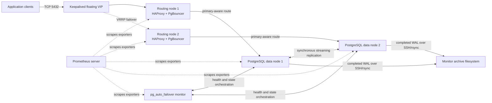

# PostgreSQL 18 HA System Architecture and Recovery Guide

## 1. Document control

| Item | Value |
|---|---|
| System | QMS PostgreSQL 18 high-availability platform |
| Platform | VMware virtual machines running Ubuntu 24.04 LTS |
| Configuration authority | Ansible repository |
| HA manager | pg_auto_failover |
| Routing tier | Keepalived, HAProxy, and PgBouncer |
| Audience | Database, infrastructure, network, backup, monitoring, and application support teams |

This is the system-level engineering and recovery authority for the project. It
consolidates material from `README.md`, `CODEBASE_ARCHITECTURE.md`,
`DEPLOYMENT_HOWTO.md`, `OPERATOR_RUNBOOK.md`, inventories, group variables,
Ansible roles/templates, and the project test framework.

The existing documents remain useful for their narrower purposes:

- `DEPLOYMENT_HOWTO.md`: initial deployment and verification;
- `CODEBASE_ARCHITECTURE.md`: Ansible repository structure and role logic;
- `OPERATOR_RUNBOOK.md`: concise day-to-day commands;
- this document: end-to-end system behavior, failure handling, and recovery.

## 2. Critical source-of-truth rules

The current repository branch defines the real UAT and Production topology and
uses the corrected data layout below:

```text
/pgdata/pgroot             XFS lv_data mount
├── data                   PGDATA directory
└── backup                 pg_autoctl base-backup staging directory
```

Production intentionally retains guarded values such as `CHANGE_ME` until the
operator supplies approved secrets, interface, logging, and NTP settings.
Storage automation is disabled for the pre-provisioned environments. Before
running any deployment or recovery command, use the Git revision deployed to
that environment, decrypt the correct environment variables, and verify the
actual values on the affected server. Never infer a destructive target from
this document alone.

Use these placeholders throughout the recovery sections:

```bash
export INVENTORY="$PWD/inventories/uat_hosts.ini"   # or prod_hosts.ini
export PGDATA=/pgdata/pgroot/data
export PGROOT=/pgdata/pgroot
export PGWAL=/pgdata/wal
export MONITOR_HOST='<inventory db_monitor hostname>'
```

Verify rather than assume:

```bash
ansible-inventory -i "$INVENTORY" --graph
ansible db_cluster -i "$INVENTORY" -b -m shell \
  -a "findmnt -R /pgdata; systemctl cat pg_autoctl | grep -E 'PGDATA|ExecStart'"
```

If a running database reports another data directory, stop and reconcile the
deployment branch, systemd unit, mounts, and this document before recovery.

## 3. Executive summary

The platform provides one writable PostgreSQL service through a floating VIP.
Two PostgreSQL data nodes are supervised by pg_auto_failover and a third node
hosts the pg_auto_failover monitor. Two routing nodes provide independent
PgBouncer pools, HAProxy primary selection, and Keepalived VIP ownership.

Automatic HA and operator recovery are different activities:

- **Automatic HA** preserves service when a healthy peer can take over.
- **Operator recovery** repairs, rebuilds, and safely rejoins the failed
  component after service has stabilized.

The design tolerates one database data-node failure and one routing-node
failure when their peers are healthy. It does not provide cross-site disaster
recovery, a redundant pg_auto_failover monitor, or a backup product by itself.
WAL archiving is a recovery input, not a complete backup policy.

## 4. Design principles

1. One authoritative writable PostgreSQL primary at a time.
2. pg_auto_failover owns database promotion and demotion.
3. Keepalived owns the application VIP; applications do not target DB nodes.
4. HAProxy enables only a route whose paired PostgreSQL node is writable.
5. PgBouncer uses transaction pooling and fixed DB-node pairing.
6. Storage identity and mount correctness are prerequisites for service start.
7. Chrony synchronization is required before HA initialization or rejoin.
8. UFW exposes only declared role-specific ports and source networks.
9. Ansible defines configuration; manual emergency changes must be reconciled
   back into Git.
10. Recovery begins read-only, then fences unsafe nodes, then changes state.

## 5. Environment topology

### 5.1 UAT

| Inventory role | Host | IP | Function |
|---|---|---|---|
| `db_primary` | `BHC-QMSSQLU05` | `192.168.129.105` | Initial data-node primary |
| `db_standby` | `BHC-QMSSQLU06` | `192.168.129.106` | Initial synchronous standby |
| `db_monitor` | `BHC-QMSSQLU07` | `192.168.129.107` | Monitor and WAL archive |
| routing slot `primary` | `BHC-PGBSQLU03` | `192.168.129.108` | Initial VIP MASTER and U05 pooler |
| routing slot `standby` | `BHC-PGBSQLU04` | `192.168.129.109` | Initial VIP BACKUP and U06 pooler |

| UAT network item | Value |
|---|---|
| Cluster CIDR | `192.168.129.0/24` |
| Application client CIDR | `192.168.24.0/24` |
| PostgreSQL VIP | `192.168.129.110/24` |
| NTP | `192.168.5.102`, `192.168.5.101` |

### 5.2 Production

| Inventory role | Host | IP | Function |
|---|---|---|---|
| `db_primary` | `BHC-QMSSQLP01.bayshore.ca` | `192.168.128.134` | Initial data-node primary |
| `db_standby` | `BHC-QMSSQLP02.bayshore.ca` | `192.168.128.135` | Initial synchronous standby |
| `db_monitor` | `BHC-QMSSQLP03.bayshore.ca` | `192.168.128.136` | Monitor and WAL archive |
| routing slot `primary` | `BHC-PGBSQLP01` | `192.168.128.137` | Initial VIP MASTER and P01 pooler |
| routing slot `standby` | `BHC-PGBSQLP02` | `192.168.128.138` | Initial VIP BACKUP and P02 pooler |

| Production network item | Value |
|---|---|
| Cluster CIDR | `192.168.128.0/24` |
| Application client CIDR | `192.168.4.0/24` |
| PostgreSQL VIP/DNS | `PGBQMSLSP01`, `192.168.128.139/24` |
| Prometheus | `BHC-PGMSQLP01`, `192.168.128.140` |

Inventory names and `host_ips` keys must match exactly. Production currently
uses FQDN inventory names for database nodes and short names for routing nodes.

## 6. Logical architecture



### 6.1 Normal write path

1. The application connects to the environment VIP on port 5432.
2. Keepalived places that VIP on exactly one routing node.
3. HAProxy considers both routing-node PgBouncer services as backends.
4. `/usr/local/sbin/check-pg-primary` maps each router to its paired database
   and runs `SELECT pg_is_in_recovery()`.
5. Only the pooler paired with a node returning `false` is eligible.
6. PgBouncer forwards the transaction to PostgreSQL.

The fixed pairings are:

| Environment | Router | Database candidate |
|---|---|---|
| UAT | U03 | U05 |
| UAT | U04 | U06 |
| Production | routing P01 | database P01 |
| Production | routing P02 | database P02 |

### 6.2 Database failover flow

```text
Primary failure
    -> monitor confirms health/state conditions
    -> standby is promoted
    -> HAProxy check detects new writable node
    -> corresponding PgBouncer backend becomes UP
    -> VIP remains available through routing tier
```

The monitor, not an operator-issued `pg_ctl promote`, orchestrates the state
transition and split-brain prevention states.

### 6.3 Routing failover flow

```text
Active router/HAProxy failure
    -> Keepalived health/VRRP detects loss
    -> peer router acquires VIP
    -> peer HAProxy selects writable-primary-paired PgBouncer
    -> clients reconnect to the same VIP
```

## 7. Component architecture

### 7.1 PostgreSQL and pg_auto_failover

- PostgreSQL 18 runs under `pg_autoctl.service`; the Debian wrapper service is
  not the database supervisor.
- The monitor database records node identities, reported states, assigned
  states, health, and orchestration decisions.
- The initial inventory role is not permanent. After failover,
  `db_standby` may be the current primary.
- Synchronous replication is managed dynamically. A healthy two-node cluster
  protects committed data according to its configured quorum policy; loss of a
  standby can cause availability-oriented policy changes.
- Data nodes and monitor use self-signed TLS with `sslmode=require` unless
  enterprise certificates replace it.

### 7.2 Routing tier

- PgBouncer listens on 6432 with transaction pooling.
- HAProxy listens on the VIP at 5432 and exposes local statistics at 8404.
- Keepalived uses unicast VRRP, priority 101/100, and tracks HAProxy.
- A PgBouncer failure removes that backend from HAProxy. Because each HAProxy
  lists both poolers, the peer pooler can still be used.
- An HAProxy failure reduces Keepalived priority so the peer should own the VIP.

### 7.3 Storage

Database-side logical volumes use XFS:

| LV | Size | Intended mount |
|---|---:|---|
| `lv_data` | 100 GiB | `/pgdata/pgroot` |
| `lv_wal` | 300 GiB | `/pgdata/wal` |
| `lv_log` | 30 GiB | `/pgdata/log` |
| `lv_tmp` | 30 GiB | `/pgdata/tmp` |
| `lv_binaries` | 100 GiB | `/pgdata/binaries` |
| `lv_dbinst` | 100 GiB | `/pgdata/dbinst` |

`PGDATA` is `/pgdata/pgroot/data`, an ordinary directory. The WAL filesystem is
bind-mounted at `$PGDATA/pg_wal`. Keeping `data` and sibling `backup` on the
same XFS filesystem permits pg_autoctl to atomically rename a completed base
backup into place.

The monitor owns `/pgdata/WalArchive`. Production P03 uses the pre-provisioned
405 GB `/dev/sdc1` XFS filesystem for this mount. Each routing node has one
120 GB `/dev/sdb1` XFS filesystem mounted at `/pgdata`, not
`/pgdata/pgroot`.

### 7.4 WAL archive and backup integration

Each data node has a dedicated Ed25519 key. `archive_command` calls
`/usr/local/sbin/archive-wal`, which:

1. checks whether the final segment already exists;
2. sends the segment as `<name>.partial` with rsync over SSH;
3. atomically renames it on the monitor;
4. optionally invokes the Rubrik RBS hook.

The durable configuration chain is:

```text
postgresql.conf
└── postgresql-ha.conf
    └── postgresql-archive.conf
```

This prevents pg_autoctl from removing archive settings when it regenerates
its base configuration. Required settings include `wal_level=replica`,
`archive_mode=on`, and the archive helper command.

WAL files alone are not a restorable backup. A tested base backup plus an
unbroken WAL sequence and configuration recovery procedure are required for
PITR.

### 7.5 Network and firewall

| Source | Destination | Protocol/port | Purpose |
|---|---|---|---|
| Control/operator networks | all nodes | TCP 22 | Ansible and SSH |
| Prometheus source | all nodes | TCP 9100 | node exporter |
| Prometheus source | DB nodes | TCP 9187 | PostgreSQL exporter |
| Prometheus source | routers | TCP 9127 | PgBouncer exporter |
| Application CIDRs | routing VIP/nodes | TCP 5432 | database service |
| Cluster/router CIDRs | routers | TCP 6432 | HAProxy to PgBouncer |
| DB/monitor cluster peers | DB nodes | TCP 5432 | PostgreSQL and monitor |
| Data nodes | monitor | TCP 22 | WAL archive transport |
| Routing peers | routing peers | IP protocol 112 | VRRP |
| All nodes | NTP sources | UDP 123 | time synchronization |

UFW defaults to deny incoming and allow outgoing. The role can reset undeclared
rules, so emergency firewall rules must be added to Ansible before the next
normal deployment.

### 7.6 Time synchronization

Chrony is installed on all nodes with `iburst`, bounded polling, `makestep`,
and RTC synchronization. Cluster initialization waits for a normal leap status.
Time failure does not directly stop an already running database, but it makes
incident timelines, monitoring, TLS validation, and coordinated HA operations
unreliable. Correct time before rejoining a node.

### 7.7 Monitoring

| Component | Port | Scope |
|---|---:|---|
| node exporter | 9100 | all nodes |
| PostgreSQL exporter | 9187 | data and monitor nodes |
| PgBouncer exporter | 9127 | routing nodes |
| HAProxy stats | 8404 | local/approved monitoring access |

Exporter failure is monitoring degradation, not database failover. Alerting
must distinguish telemetry loss from service loss.

### 7.8 Ansible control plane

Ansible bootstraps SSH keys, enforces the OS baseline, configures storage,
creates the monitor before the data nodes, deploys the routing tier, and
installs monitoring. The running platform has no dependency on the Ansible
control server. Loss of the controller removes configuration-management and
recovery automation only.

## 8. Availability model and failure domains

| Failure | Automatic response | Remaining risk |
|---|---|---|
| One data node | Peer can provide DB service | no DB-node redundancy until repair |
| Active routing node | VIP transfers to peer | no routing redundancy until repair |
| One PgBouncer | HAProxy removes backend | capacity/redundancy reduced |
| HAProxy on VIP owner | Keepalived moves VIP | routing redundancy reduced |
| Monitor | current DB service may continue | automated DB failover unavailable |
| WAL archive filesystem | DB continues while `pg_wal` has space | RPO chain and eventual DB availability at risk |
| Prometheus/exporter | no direct service effect | reduced detection and evidence |
| Ansible controller | no direct service effect | configuration recovery delayed |
| Entire site | no cross-site automatic recovery | restore depends on external backups/WAL |

The monitor, archive target, vCenter/storage infrastructure, network, and site
are shared dependencies. Their protection must be handled by infrastructure
and backup designs outside this five-node HA topology.

## 9. Recovery framework

### 9.1 Command risk labels

- **[R] READ-ONLY / SAFE**: observation; no intended state change.
- **[S] SERVICE-AFFECTING**: restart, switchover, mount, firewall, or VIP action.
- **[D] DESTRUCTIVE / CHANGE APPROVAL REQUIRED**: membership removal, data
  directory replacement, formatting, restore, or forced state change.

### 9.2 Universal incident sequence

1. Declare the incident and record UTC/local timestamps.
2. Freeze unrelated deployments and automation.
3. Identify the selected inventory and actual PGDATA/mounts.
4. Observe monitor, SQL, VIP, routing, storage, time, and logs.
5. Determine whether exactly one writable primary exists.
6. Fence any node that might create split brain.
7. Let automatic HA stabilize before repairing redundancy.
8. Repair/rebuild one component at a time.
9. Validate the complete VIP-to-primary path.
10. Reconcile emergency changes into Ansible/Git and close with evidence.

### 9.3 Baseline diagnostic bundle

**[R]** Run from the control server:

```bash
ansible-inventory -i "$INVENTORY" --graph

ansible db_monitor -i "$INVENTORY" -b --become-user postgres \
  -m command -a "pg_autoctl show state --pgdata $PGDATA"

ansible db_primary:db_standby -i "$INVENTORY" -b \
  --become-user postgres -m shell \
  -a "pg_isready -h 127.0.0.1 -p 5432; psql -X -At -d postgres \
  -c \"SELECT host(inet_server_addr()), pg_is_in_recovery(), \
  CASE WHEN pg_is_in_recovery() THEN pg_last_wal_replay_lsn()::text \
  ELSE pg_current_wal_lsn()::text END;\""

ansible all_nodes -i "$INVENTORY" -b -m shell \
  -a "hostname; date -Ins; chronyc tracking; systemctl --failed --no-pager"

ansible db_cluster -i "$INVENTORY" -b -m shell \
  -a "findmnt -R /pgdata; df -hT /pgdata /pgdata/* 2>/dev/null || true"

ansible routing_nodes -i "$INVENTORY" -b -m shell \
  -a "ip -br -4 address; systemctl is-active keepalived haproxy pgbouncer; \
  echo 'show stat' | socat stdio /run/haproxy/admin.sock"
```

Archive outputs before modifying state.

### 9.4 Absolute guardrails

Do not:

- format any disk or run `mkfs` until device identity and backup approval are
  independently confirmed;
- delete PGDATA merely because a playbook failed;
- start PostgreSQL on an unmounted `/pgdata` hierarchy;
- restore a former primary VM onto the network with PostgreSQL running;
- promote with `pg_ctl promote` while pg_auto_failover owns the cluster;
- restart both data nodes simultaneously;
- use `pg_resetwal`, data-loss flags, forced monitor state, or low-level FSM
  commands without PostgreSQL/pg_auto_failover specialist approval;
- allow two routing nodes to advertise the same VIP during uncertainty;
- treat WAL files without a compatible base backup as a complete backup.

## 10. Recovery decision matrix

| Scenario | First action | Automatic HA? | Recovery objective |
|---|---|---|---|
| Primary DB fails | observe monitor and fence failed VM if uncertain | normally yes | rejoin/reseed failed node as secondary |
| Standby DB fails | confirm primary remains writable | no service failover needed | restore redundancy |
| Former primary returns | keep fenced until role is known | service already failed over | rejoin only as secondary |
| Monitor fails | confirm exactly one writable primary | no monitor redundancy | restore or replace monitor |
| DB filesystem fails | stop pg_autoctl on affected node | peer may take over | repair mounts or rebuild node |
| Archive fills/fails | check DB `pg_wal` free space | no | restore archive before WAL fills |
| Active router fails | confirm peer owns VIP | yes | restore routing redundancy |
| VIP split brain | fence one router | unsafe condition | restore exactly one owner |
| PgBouncer fails | inspect HAProxy backends | usually | restore pooler |
| HAProxy fails | confirm VIP moved | normally | repair HAProxy then Keepalived |
| Network partition | freeze manual promotion | depends on visibility | restore connectivity/fencing |
| NTP fails | avoid planned HA changes | no | resynchronize time |
| Controller fails | preserve runtime | no effect | rebuild management plane |

## 11. Database-node recovery procedures

### 11.1 Current primary failure

**Detection**

- monitor shows the primary unhealthy and assigns promotion states;
- VIP SQL reconnects to the former standby;
- the promoted node returns `pg_is_in_recovery() = false`.

**Expected automatic response**

The healthy standby is promoted and HAProxy enables its paired PgBouncer path.

**Procedure**

1. **[R]** Capture the baseline diagnostic bundle.
2. **[S]** If the failed VM's power/network state is uncertain, fence it in
   VMware before any manual intervention.
3. **[R]** Wait for monitor reported and assigned states to become stable.
4. **[R]** Verify VIP SQL reaches the promoted node.
5. Decide whether the failed node has intact, trustworthy storage.
6. If intact, follow Section 11.3. If corrupt or replaced, follow Section 11.4.

Do not switch back merely to restore the original host naming convention.
Stability and data correctness take priority.

### 11.2 Standby failure

The primary normally remains available, but redundancy and synchronous data
protection are reduced.

1. **[R]** Check monitor state, `journalctl -u pg_autoctl`, mounts, disk space,
   Chrony, and network reachability.
2. **[S]** For a transient service failure with correct storage, restart only
   the affected node:

   ```bash
   sudo systemctl restart pg_autoctl
   ```

3. **[R]** Wait for `catchingup` then stable `secondary` state.
4. If PostgreSQL cannot catch up, system identifiers differ, or storage is
   corrupt, use the rebuild procedure.

### 11.3 Rejoin an intact failed/former-primary node

Prerequisites: the node is fenced until checked, mounts are correct, its
PostgreSQL system identifier matches the active cluster, and the monitor has a
single stable primary.

1. **[R]** Verify mounts before enabling service:

   ```bash
   findmnt "$PGROOT"
   findmnt "$PGDATA/pg_wal"
   sudo -u postgres /usr/lib/postgresql/18/bin/pg_controldata "$PGDATA" \
     | grep 'Database system identifier'
   ```

2. Compare the identifier with the active primary.
3. **[S]** Start `pg_autoctl`, not the Debian PostgreSQL wrapper:

   ```bash
   sudo systemctl start pg_autoctl
   ```

4. **[R]** Watch monitor state and logs. A former primary must return as a
   secondary; pg_auto_failover may use rewind or another synchronization path.
5. If it loops, diverges, or cannot safely rewind, stop it and rebuild rather
   than forcing it writable.

### 11.4 Rebuild and reseed a database node

This is **[D]** and requires a verified healthy primary, approved maintenance,
backup/rollback plan, and exact target confirmation.

1. Fence and stop the failed node.
2. Record monitor state, node name, host/IP, system identifier, and Git commit.
3. Remove the stale node registration using the supported `pg_autoctl drop
   node` workflow. Prefer running it locally before replacement; if the node is
   gone, an approved operator may use the monitor URI with `--name` and
   `--force`. Never add `--destroy` casually.
4. Preserve or rename the old PGDATA/config/state for forensic rollback. Do
   not recursively delete until the target is independently verified.
5. Repair or recreate only the failed node's approved storage. Confirm
   `/pgdata/pgroot`, `/pgdata/wal`, ownership, XFS, and `/etc/fstab`.
6. Ensure `$PGDATA` is absent or empty and `$PGROOT/backup` has enough free
   space. The active primary and monitor must be reachable.
7. Re-run the approved pg_auto_failover node provisioning for this inventory
   host, or execute the same `pg_autoctl create postgres` arguments generated
   by the role. The monitor URI contains a secret and must not be logged.
8. Start `pg_autoctl.service` and allow pg_basebackup to complete.
9. Reapply workload, HBA, WAL bind mount, archiving, exporter, and monitoring
   roles without repartitioning pre-provisioned Production disks.
10. Validate stable secondary state, streaming, synchronous policy, archive
    capability, and VIP SQL.

The official pg_auto_failover behavior is to initialize an empty secondary
with `pg_basebackup`; an existing directory is accepted only when its system
identifier matches the group. Treat that check as protection, not as a reason
to reuse a questionable VM snapshot.

### 11.5 Recover a database node from a VM backup

VM snapshots are not automatically application-consistent PostgreSQL backups.

1. **[S]** Restore the VM with its production NIC disconnected and autostart
   of `pg_autoctl` disabled.
2. Verify snapshot time, storage consistency, PGDATA, WAL mount, system
   identifier, and whether the node was primary at backup time.
3. Determine the current cluster primary from the live monitor and SQL.
4. Never attach a restored former-primary snapshot while it can start writable.
5. Preferred method: use the VM restore to recover OS/configuration only, then
   discard/reseed its PostgreSQL data as a new secondary using Section 11.4.
6. Reconnect networking only after fencing controls and startup state are
   reviewed.
7. Start `pg_autoctl`, verify secondary state, then re-enable normal boot.

### 11.6 Planned database switchover

Use only when both nodes are stable:

```bash
sudo -u postgres pg_autoctl perform switchover --pgdata "$PGDATA"
```

The command is **[S]**. It waits for monitor orchestration; a client-side
timeout does not prove failure because orchestration may continue. Always query
monitor state before retrying.

## 12. Monitor recovery procedures

### 12.1 Monitor service/VM failure with intact storage

Existing PostgreSQL service may continue, and HAProxy can still identify the
writable node, but automated DB failover is unavailable or impaired.

1. **[R]** Confirm exactly one data node is writable using direct SQL.
2. Freeze planned database maintenance and manual promotion.
3. **[R]** Check monitor mounts, `pg_autoctl` logs, PostgreSQL readiness, disk
   space, and Chrony.
4. **[S]** If storage is intact, start/restart only monitor `pg_autoctl`.
5. Verify both data nodes reconnect and stable states return.

### 12.2 Monitor database/storage lost: replace monitor

This is **[D]**. Follow the supported online monitor-replacement ordering:

1. Fence the old monitor so it cannot reappear.
2. Identify exactly one current PostgreSQL primary without relying on the old
   monitor.
3. On every data node, ending with the current primary, run:

   ```bash
   sudo -u postgres pg_autoctl disable monitor --force --pgdata "$PGDATA"
   ```

4. Rebuild the monitor storage/VM and create a new monitor with the approved
   Ansible role and original address/DNS where possible.
5. Configure monitor password, TLS, HBA, exporter, and firewall.
6. Register the current primary first:

   ```bash
   sudo -u postgres pg_autoctl enable monitor \
     --monitor '<NEW_MONITOR_URI>' --pgdata "$PGDATA"
   ```

7. Register the secondary afterward with the same form.
8. Verify the monitor assigns primary/secondary consistently with SQL reality.
9. Restore monitoring and archive SSH authorization.

Never allow the fenced old monitor to return after nodes attach to the new one.

## 13. Storage recovery procedures

### 13.1 `/pgdata` or DB mount missing after reboot

Starting pg_autoctl against an unmounted directory can create or modify files
on the OS filesystem and conceal the real database when the mount returns.

1. **[S]** Stop `pg_autoctl` on the affected node immediately.
2. **[R]** Inspect `lsblk -f`, `blkid`, `findmnt -R /pgdata`, `/etc/fstab`, and
   LVM metadata.
3. Confirm the expected UUID/device from build records and its filesystem type.
4. Check for accidental files under the unmounted path and preserve them for
   analysis.
5. **[S]** Correct `/etc/fstab`, run `mount -a`, and verify all mount sources.
6. Confirm owner/mode and that `$PGDATA/pg_wal` resolves to the WAL LV.
7. Start `pg_autoctl` and validate cluster state.

Do not format a device merely because it is not mounted.

### 13.2 Routing-node mount at the wrong path

The routing XFS filesystem must be mounted at `/pgdata`. If it is mounted at
`/pgdata/pgroot`, verify it contains no required active files, stop processes
using it, back up `/etc/fstab`, unmount it, change only the mount target to
`/pgdata`, and remount. This is **[S]** but non-destructive when the source UUID
is unchanged.

Validate:

```bash
findmnt /pgdata
df -Th /pgdata
sudo findmnt --verify --verbose
```

### 13.3 Database data/WAL filesystem failure

- If the affected node is standby, stop it and rebuild it after storage repair.
- If it is primary, allow/facilitate monitor-controlled failover, fence the
  failed node, then rebuild it as secondary.
- Preserve failed media for forensic/storage-team analysis.
- Recreate LVs/filesystems only under an approved rebuild record.
- Never copy individual PostgreSQL data files between nodes.

## 14. WAL archive recovery procedures

### 14.1 Archive filesystem full

If `archive_command` fails, PostgreSQL retains WAL locally. Continued workload
can fill the WAL LV and stop the database.

1. **[R]** Check monitor archive and data-node WAL capacity:

   ```bash
   df -hT /pgdata/WalArchive
   sudo -u postgres psql -X -d postgres -c \
     "SELECT archived_count, failed_count, last_archived_wal, \
     last_failed_wal, last_failed_time FROM pg_stat_archiver;"
   ```

2. Escalate immediately if data-node `/pgdata/wal` free space is declining.
3. Expand archive capacity or remove files only under the approved
   backup-retention policy after confirming the required base-backup/WAL chain.
4. Do not set `archive_command=/bin/true`; that discards recoverability.
5. Force a WAL switch and confirm a new segment arrives after remediation.

### 14.2 Archive SSH/transport failure

**[R]** From each data node:

```bash
sudo -u postgres ssh \
  -i /var/lib/postgresql/.ssh/id_ed25519_wal_archive \
  -o BatchMode=yes postgres@'<MONITOR_IP>' \
  'test -w /pgdata/WalArchive'
```

Check monitor `AllowGroups`, `authorized_keys`, ownership/modes, host keys,
UFW TCP 22, DNS/IP mapping, and filesystem writability. Re-run the approved
`backup_wal` role after correcting the cause, then validate `pg_stat_archiver`.

### 14.3 Archive monitor unavailable

Database service continues only while local WAL storage has capacity. Restore
monitor/SSH/archive storage urgently, watch WAL usage, and consider controlled
application throttling if space approaches the operational threshold. Confirm
the backlog drains before declaring recovery.

### 14.4 PITR or backup restore

PITR is a disaster-recovery operation, not a node-rejoin shortcut. It requires
a compatible base backup, all required WAL and timeline history files, a
separate restore location or fenced cluster, recovery configuration, and data
validation. Follow the PostgreSQL 18 recovery procedure and the approved Rubrik
runbook. Do not start a PITR-restored server alongside the live HA cluster.

## 15. Routing-tier recovery procedures

### 15.1 Active VIP owner fails

1. **[R]** Confirm the peer has the VIP and HAProxy/PgBouncer are active.
2. **[R]** Test VIP SQL and confirm `pg_is_in_recovery() = false`.
3. Repair the failed router without moving the VIP manually.
4. Validate its Keepalived config and services before it rejoins VRRP.
5. Expect the priority-101 router to reclaim the VIP when healthy unless
   nopreempt is configured.

### 15.2 PgBouncer failure

HAProxy should mark the failed pooler backend down and use the peer pooler when
that peer's paired database is writable.

```bash
sudo systemctl status pgbouncer --no-pager
sudo journalctl -u pgbouncer -n 200 --no-pager
sudo ss -lntp | grep ':6432'
```

After correction, restart PgBouncer, verify `SHOW POOLS`, and inspect the
HAProxy runtime socket.

### 15.3 HAProxy failure

Keepalived tracks HAProxy and should move the VIP. Validate before restart:

```bash
sudo haproxy -c -f /etc/haproxy/haproxy.cfg
sudo -u haproxy env HAPROXY_SERVER_ADDR='<paired-database-IP>' \
  /usr/local/sbin/check-pg-primary
sudo systemctl restart haproxy
```

Confirm exactly one VIP owner afterward.

### 15.4 Keepalived failure or missing VIP

```bash
sudo keepalived --config-test --log-console \
  -f /etc/keepalived/keepalived.conf
ip -br -4 address
sudo journalctl -u keepalived -n 200 --no-pager
```

Verify `keepalived_interface`, local/peer IPs, VRRP ID, auth token, protocol 112
firewall rules, and HAProxy health. Restart one Keepalived instance at a time.

### 15.5 VIP split brain

This is a critical **[S]** incident.

1. Stop application changes if duplicate VIP behavior is causing ambiguity.
2. Identify both owners from an independent network point.
3. Fence or stop Keepalived on the router that must not own the VIP.
4. Remove a duplicate IP manually only after Keepalived is stopped on that
   router and the correct owner is established.
5. Repair VRRP reachability/configuration and verify a single owner before
   re-enabling the peer.

### 15.6 Complete routing-tier outage

The database may remain healthy but applications cannot use the VIP. Restore
one router first in this order: network/mounts, PgBouncer, HAProxy validation,
HAProxy start, Keepalived validation, Keepalived start, VIP SQL test. Restore
the peer only after the first router is stable.

## 16. Network, time, firewall, and monitoring recovery

### 16.1 Network partition

Do not manually promote a node merely because it cannot see its peer. Determine
connectivity among both data nodes, monitor, routers, and client networks.
Fence a potentially isolated former primary before any forced recovery. Restore
network paths and allow the monitor FSM to converge. Low-level manual FSM
commands require specialist approval and stopped automation.

### 16.2 Chrony/NTP failure

```bash
chronyc tracking
chronyc sources -v
sudo journalctl -u chrony -n 100 --no-pager
```

Repair DNS/UDP 123 or internal NTP configuration. If a large step is necessary,
coordinate it and avoid failover testing during the correction. Require `Leap
status: Normal` before node rejoin.

### 16.3 UFW lockout or missing connectivity

Use VMware console/out-of-band access. Capture `ufw status numbered`, compare
with the role matrix, correct the Ansible variables, and rerun the firewall role
with SSH permitted before enabling UFW. Do not leave an untracked permanent
emergency rule.

### 16.4 Exporter/Prometheus failure

Confirm the underlying service independently before treating an exporter alert
as a platform outage. Restart only the failed exporter, verify its local metrics
endpoint, UFW source CIDR, credentials, and Prometheus scrape configuration.

## 17. Ansible control-node recovery

The database and routing services continue without Ansible.

1. Provision a supported Linux control server.
2. Clone the correct Git branch/commit.
3. Restore the protected Vault password mechanism and operator SSH private key
   through the approved secrets process.
4. Install Ansible and `requirements.yml` collections.
5. Verify inventory graph, Git status, SSH fingerprints, and `ansible all -m
   ping` before mutation.
6. Run syntax/lint and read-only health checks.
7. Reconcile any incident-time manual changes into Git before a full playbook
   run.

Never store Vault plaintext or private keys in the repository.

## 18. Complete database-tier outage

This is a disaster-recovery event and **[D]**.

1. Fence both data nodes and prevent automatic starts.
2. Preserve disks and logs; do not repeatedly start inconsistent clusters.
3. Determine the most authoritative recoverable source: intact node, verified
   base backup plus WAL, or approved Rubrik restore.
4. Compare system identifiers, control data, timelines, and last WAL positions.
5. Restore one isolated node and validate data before allowing application
   access.
6. Establish it as the sole primary under a valid monitor/rebuilt monitor.
7. Rebuild the second node from that primary.
8. Restore routing only after one primary is proven and HAProxy health checks
   agree.
9. Perform application-level consistency validation and obtain owner approval.

`pg_resetwal` is not a normal recovery tool. Its use can create unrecoverable
logical inconsistency and requires senior PostgreSQL/vendor approval.

## 19. Site-level disaster

The five-node design is single-site HA, not cross-site DR. Recovery from total
VMware/storage/site loss depends on off-site Rubrik/base backups, retained WAL,
DNS/network reconstruction, secrets, and a tested DR environment. Documented
RPO and RTO must come from measured restore tests; the architecture alone does
not guarantee them.

A site recovery should rebuild in this order:

1. network, DNS, NTP, identity, and storage;
2. monitor or temporary recovery control plane;
3. one restored and validated PostgreSQL primary;
4. second PostgreSQL node;
5. routing pair and VIP;
6. exporters, Prometheus, Logstash/Rubrik integrations;
7. application connectivity and business validation.

## 20. Post-recovery validation

Minimum acceptance evidence:

1. `pg_autoctl show state` contains both data nodes with matching stable
   reported/assigned states.
2. Exactly one node returns `pg_is_in_recovery() = false`.
3. Standby is streaming and caught up within the approved lag threshold.
4. Synchronous settings match policy.
5. Exactly one router owns the VIP.
6. HAProxy shows an UP write backend paired with the current primary.
7. PgBouncer `SHOW POOLS` succeeds.
8. VIP SQL reaches the current primary.
9. All required XFS/LVM/bind mounts and `/etc/fstab` entries are correct.
10. Chrony reports a selected source and normal leap status.
11. UFW shows the expected role matrix.
12. Node, PostgreSQL, and PgBouncer metrics endpoints respond.
13. A forced WAL switch produces a new file in `/pgdata/WalArchive` and
    `failed_count` does not increase.
14. `systemctl --failed` contains no required service.
15. Emergency changes are committed/reviewed in Git.

Example VIP validation:

```bash
PGPASSWORD='<app password>' psql \
  "host=<VIP> port=5432 dbname=qms user=qms_app sslmode=require" \
  -X -c "SELECT host(inet_server_addr()), pg_is_in_recovery();"
```

## 21. Recovery testing

- Run read-only health tests after every deployment and recovery.
- Run WAL archive tests after archive, key, firewall, or storage changes.
- Run routing failover tests in an approved window.
- Run controlled database switchover tests only when both nodes are stable.
- Test VM restore and full backup/PITR recovery in an isolated network.
- Record actual detection, failover, rebuild, resync, and validation times.
- Never run disruptive tests against Production by relying on a wrapper's UAT
  default; set and verify the inventory explicitly.

## 22. RTO and RPO considerations

| Event | RPO characteristic | RTO driver |
|---|---|---|
| Healthy synchronous DB failover | intended near-zero committed-data loss | monitor detection, promotion, client reconnect |
| Routing failover | no database data loss | VRRP detection and reconnect |
| Standby rebuild | primary remains source | base-backup size and network throughput |
| PITR | last continuous archived WAL available | base restore plus WAL replay |
| Archive interruption | RPO worsens if WAL chain is lost | archive repair and backlog drain |
| Site disaster | depends on off-site backup/WAL | infrastructure and full restore process |

These are characteristics, not contractual objectives. Set formal RTO/RPO only
after business approval and measured recovery exercises.

## 23. Known limitations and required improvements

- pg_auto_failover monitor is a single control-plane node.
- WAL archive storage on the monitor is a single archive target.
- Self-signed TLS encrypts traffic but does not provide enterprise CA identity
  assurance.
- Keepalived VRRP PASS authentication is limited and is not encryption.
- No automatic cross-site failover is implemented.
- Rubrik hook is optional and must be paired with a tested restore runbook.
- Production guard values must be replaced and validated before deployment;
  never work around the preflight assertions merely to make a playbook run.
- Recovery automation should add explicit storage-disable controls, targeted
  node-reseed playbooks, and non-destructive preflight assertions.

## 24. Repository component map

| Concern | Repository source |
|---|---|
| Play sequencing | `site.yml` |
| Bootstrap authentication | `bootstrap.yml`, `roles/push_ssh_keys` |
| Environment topology | `inventories/*.ini`, `group_vars/*.yml` |
| LVM/XFS/mounts | `roles/storage_lvm` |
| Chrony, sysctl, limits, hosts | `roles/os_tuning` |
| UFW | `roles/ufw_firewall` |
| PostgreSQL/monitor/service | `roles/pg_auto_failover` |
| PgBouncer | `roles/pgbouncer` |
| VIP and primary-aware routing | `roles/keepalived_haproxy` |
| WAL archive/users/Rubrik hook | `roles/backup_wal` |
| Exporters/Logstash | `roles/monitoring_agents` |
| Deployment procedure | `DEPLOYMENT_HOWTO.md` |
| Code internals | `CODEBASE_ARCHITECTURE.md` |
| Concise operations | `OPERATOR_RUNBOOK.md` |

## 25. External technical references

- [pg_auto_failover operations and monitor replacement](https://pg-auto-failover.readthedocs.io/en/main/operations.html)
- [pg_autoctl create postgres](https://pg-auto-failover.readthedocs.io/en/main/ref/pg_autoctl_create_postgres.html)
- [pg_autoctl drop node](https://pg-auto-failover.readthedocs.io/en/main/ref/pg_autoctl_drop_node.html)
- [pg_autoctl perform switchover](https://pg-auto-failover.readthedocs.io/en/main/ref/pg_autoctl_perform_switchover.html)
- [PostgreSQL 18 backup and restore](https://www.postgresql.org/docs/18/backup.html)
- [PostgreSQL WAL and archive recovery configuration](https://www.postgresql.org/docs/18/runtime-config-wal.html)

## 26. Incident record template

```text
Incident ID:
Environment:
Start time (UTC/local):
Reported symptom:
Current VIP owner:
Current writable DB node:
Monitor state captured:
Affected mounts/devices:
Fencing actions:
Automatic HA result:
Operator recovery actions:
Data-loss assessment:
Post-recovery validation evidence:
Git/Ansible reconciliation commit:
End time:
Approvals and participants:
Lessons/actions:
```
