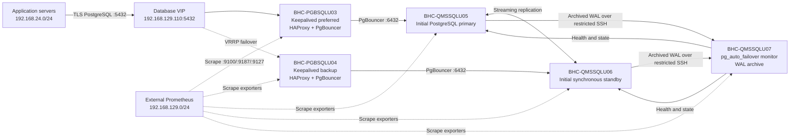

# PostgreSQL High-Availability UAT Environment Handover

## Document control

| Item | Value |
|---|---|
| Environment | UAT |
| Platform | PostgreSQL 18 HA and connection-routing tier |
| Handover date | 5 August 2026 |
| Prepared by | `[IMPLEMENTATION TEAM / NAME]` |
| Receiving team | `[CLIENT TEAM / OWNER]` |
| Document status | Ready for client review and acceptance |
| Repository | `ansible-pg-ha` |

## 1. Handover statement

The PostgreSQL 18 UAT environment has been deployed, configured, and tested.
The database, routing, monitoring-agent, firewall, time-synchronization, storage,
and WAL-archive checks have completed successfully. Controlled database and
routing failover tests have also completed successfully, including restoration
of the preferred topology.

The environment is ready for client application connectivity, functional
testing, operational familiarization, and UAT acceptance.

This handover covers the complete five-server platform. Passwords, private
keys, Vault passwords, and other secrets are deliberately excluded and must be
transferred using an approved secure channel.

## 2. Scope

The handed-over environment includes:

- two PostgreSQL 18 data nodes managed by pg_auto_failover;
- one pg_auto_failover monitor and WAL archive node;
- two routing nodes running Keepalived, HAProxy, and PgBouncer;
- a floating application database VIP;
- LVM-backed XFS database storage;
- Chrony time synchronization;
- role-based UFW firewall enforcement;
- Prometheus node, PostgreSQL, and PgBouncer exporters;
- SSH-based WAL archiving to the monitor node;
- Ansible deployment, configuration, verification, and failover tests.

The following external services are not delivered as active integrations:

- Rubrik Backup Service integration is prepared as a hook but is disabled;
- Logstash forwarding is disabled;
- a central Prometheus server, dashboards, alert rules, and notification routes
  are not deployed by this repository;
- enterprise CA-signed certificates are not installed.

## 3. Architecture overview



The application write path is:

```text
Application
  -> 192.168.129.110:5432
  -> HAProxy on the current VIP owner
  -> PgBouncer paired with the current writable database
  -> PostgreSQL primary:5432
```

HAProxy checks `pg_is_in_recovery()` and only enables the PgBouncer path paired
with the writable PostgreSQL node. Applications must use the VIP and must not
connect directly to an individual database server.

## 4. Server inventory

| Hostname | IP address | Role | vCPU | RAM | Approximate storage |
|---|---:|---|---:|---:|---:|
| `BHC-QMSSQLU05` | `192.168.129.105` | Initial PostgreSQL primary | 16 | 32 GB | 700 GB |
| `BHC-QMSSQLU06` | `192.168.129.106` | Initial synchronous standby | 16 | 32 GB | 700 GB |
| `BHC-QMSSQLU07` | `192.168.129.107` | Monitor and WAL archive | 8 | 16 GB | 1.1 TB |
| `BHC-PGBSQLU03` | `192.168.129.108` | Preferred routing/VIP node | 8 | 16 GB | 160 GB |
| `BHC-PGBSQLU04` | `192.168.129.109` | Backup routing/VIP node | 8 | 16 GB | 160 GB |

All servers run hardened Ubuntu 24.04 LTS on VMware.

## 5. Client service endpoints

### 5.1 Application database endpoint

| Setting | Value |
|---|---|
| Host/VIP | `192.168.129.110` |
| Port | `5432/tcp` |
| Database | `qms` |
| Username | `qms_app` |
| SSL mode | `require` |
| Authorized source network | `192.168.24.0/24` |
| Pooling mode | PgBouncer transaction pooling |

Connection string without the password:

```text
postgresql://qms_app@192.168.129.110:5432/qms?sslmode=require
```

Application teams must receive only the `qms_app` password. The password must
be sent separately through the approved enterprise secret-transfer mechanism.

### 5.2 Operational endpoints

| Endpoint | Port | Intended consumer | Exposure |
|---|---:|---|---|
| Node exporter | `9100/tcp` | Prometheus | Scraper network only |
| PostgreSQL exporter | `9187/tcp` | Prometheus | DB hosts; scraper network only |
| PgBouncer exporter | `9127/tcp` | Prometheus | Routing hosts; scraper network only |
| PgBouncer listener | `6432/tcp` | HAProxy/internal diagnostics | Cluster network only |
| HAProxy statistics | `8404/tcp` | Local operations | Bound locally by service but not opened by UFW |
| SSH | `22/tcp` | Named administrators/Ansible | See security follow-up in Section 14 |

## 6. High-availability behavior

### 6.1 Database layer

`pg_autoctl.service` owns the PostgreSQL lifecycle on all database nodes.
Operators must not independently promote a server or start a second writable
PostgreSQL instance.

Normal state:

- one node reports `primary / primary` and is read-write;
- one node reports `secondary / secondary` and is read-only;
- the standby participates in synchronous replication;
- the monitor controls promotion, demotion, and rejoin decisions.

After a database failure, pg_auto_failover promotes the eligible standby. A
recovered former primary is expected to rejoin as a standby after reconciliation.

### 6.2 Routing layer

Keepalived normally places the VIP on `BHC-PGBSQLU03`. If that node or its
HAProxy service becomes unavailable, `BHC-PGBSQLU04` acquires the VIP.

HAProxy runs on both routing nodes. Only a PgBouncer backend paired with the
current writable PostgreSQL node is enabled for application traffic.

### 6.3 Application behavior

Applications should:

- use only the VIP;
- use connection timeouts and retry transient connection failures;
- reconnect after a failover instead of retaining broken sessions indefinitely;
- avoid session-dependent behavior that conflicts with transaction pooling;
- use `sslmode=require` until enterprise certificates are installed.

Existing database sessions can be interrupted during a database or routing
failover. In-flight transactions may need to be retried by the application.

## 7. Storage layout

UAT storage was pre-partitioned, formatted, mounted, and entered in `/etc/fstab`;
therefore `storage_lvm_enabled` is `false` for UAT to prevent reprovisioning.

### 7.1 Database nodes U05/U06

| Logical volume | Size | Mount point | Purpose |
|---|---:|---|---|
| `lv_data` | 100 GB | `/pgdata/pgroot` | PGDATA filesystem root and backup sibling |
| `lv_wal` | 300 GB | `/pgdata/wal` | PostgreSQL WAL |
| `lv_log` | 30 GB | `/pgdata/log` | Database logs |
| `lv_tmp` | 30 GB | `/pgdata/tmp` | Temporary workspace |
| `lv_binaries` | 100 GB | `/pgdata/binaries` | Binary/software area |
| `lv_dbinst` | 100 GB | `/pgdata/dbinst` | Instance-support area |

PostgreSQL uses `/pgdata/pgroot/data` as PGDATA. It is a normal directory inside
the `lv_data` filesystem, not a separate mount point. WAL is persistently bind
mounted from `/pgdata/wal` to `/pgdata/pgroot/data/pg_wal`.

### 7.2 Monitor/archive node U07

U07 has the same `vg_pgdata` logical-volume layout and a separate 400 GB XFS
archive filesystem mounted at:

```text
/pgdata/WalArchive
```

### 7.3 Routing nodes

Each routing node has a 120 GB XFS filesystem mounted at `/pgdata`.

Do not remove, reformat, or remount these filesystems without an approved
database recovery procedure.

## 8. Backup and recovery position

PostgreSQL WAL archiving is enabled on both data nodes:

```text
wal_level = replica
archive_mode = on
archive_command = '/usr/local/sbin/archive-wal "%p" "%f"'
archive_timeout = 300s
```

WAL files are transferred using source-restricted SSH keys to:

```text
BHC-QMSSQLU07:/pgdata/WalArchive
```

Important limitations:

- WAL archiving alone is not a complete backup-and-restore solution;
- the Rubrik RBS hook is installed as a placeholder but is disabled;
- backup retention, full/base-backup scheduling, catalog protection, off-host
  copies, restore testing, RPO, and RTO require client approval and ownership;
- VM backups must capture all database-related virtual disks consistently;
- a VM backup must never be started alongside the original VM with the same
  hostname and IP address.

Before Production, the client backup team must confirm the approved backup
product, policy, retention, RPO/RTO, encryption, immutable/off-site copy, and
restore-test schedule.

## 9. Monitoring and logging

Installed exporters:

| Scope | Service | Port |
|---|---|---:|
| All five nodes | `prometheus-node-exporter` | 9100 |
| U05/U06/U07 | `prometheus-postgres-exporter` | 9187 |
| U03/U04 | `prometheus-pgbouncer-exporter` | 9127 |

The allowed Prometheus scraper network is `192.168.129.0/24`.

The client monitoring team remains responsible for:

- adding scrape targets to central Prometheus;
- dashboards and alert rules;
- alert routing, severity, and on-call ownership;
- capacity thresholds for data, WAL, archive, connections, replication lag,
  exporter health, clock drift, and service availability;
- retention and protection of monitoring data.

Logstash forwarding is currently disabled. System and service logs remain in
systemd journal and component-specific files. Central log-forwarding ownership
must be agreed separately.

## 10. Time synchronization

Chrony runs on all nodes using the UAT NTP sources:

```text
192.168.5.102
192.168.5.101
```

Clock synchronization is required for cluster decisions, authentication,
logging, and incident correlation.

## 11. Security controls

Implemented controls include:

- UFW default incoming deny and outgoing allow;
- UFW logging enabled;
- role-scoped database, routing, VRRP, and exporter rules;
- application ingress restricted to `192.168.24.0/24`;
- PostgreSQL and PgBouncer TLS transport;
- encrypted Ansible Vault variables for the application and selected service
  passwords;
- protected credential files;
- dedicated database, health-check, exporter, and pooling accounts;
- source-restricted WAL SSH keys;
- a dedicated `postgres-wal-ssh` group permitted by the monitor's hardened
  SSH `AllowGroups` policy;
- strict ownership and permissions on SSH and PostgreSQL files.

Security items requiring client review before Production:

- PostgreSQL and PgBouncer certificates are self-signed;
- `sslmode=require` encrypts traffic but does not validate enterprise identity;
- `host_key_checking=False` is configured for Ansible;
- UFW SSH source access currently defaults to `any` and should be restricted to
  approved management networks;
- PgBouncer's protected user list contains plaintext credentials required for
  backend authentication;
- all temporary/default UAT service secrets must be rotated before Production;
- Vault-password custody, break-glass access, and rotation procedures must be
  formally assigned.

## 12. Credential handover

Do not insert secret values into this document, email, ticket comments, chat,
or source-control history.

| Credential | Recipient | Transfer requirement |
|---|---|---|
| `qms_app` database password | Application owner | Approved secure secret channel |
| Named Linux/SSH access | Authorized operations staff | Individual account and SSH key |
| Ansible Vault password | Designated automation custodians only | Enterprise password vault |
| PostgreSQL monitor/replication credentials | Database platform custodians only | Enterprise password vault |
| Exporter and HAProxy health credentials | Monitoring/platform custodians only | Enterprise password vault |
| Keepalived authentication token | Network/platform custodians only | Enterprise password vault |
| WAL private keys | No manual distribution | Remain protected on source nodes |

Shared administrative passwords and shared private SSH keys are not approved
handover mechanisms.

## 13. Standard operational checks

Run from the Ansible control server with the approved Vault mechanism.

### Overall health

```bash
bash tests/run_health.sh --ask-vault-pass
```

### Cluster state

```bash
ansible BHC-QMSSQLU07 -i inventories/uat_hosts.ini \
  -b --become-user postgres -m command \
  -a "pg_autoctl show state --pgdata /pgdata/pgroot/data"
```

### VIP ownership

```bash
ansible routing_nodes -i inventories/uat_hosts.ini -b -m shell \
  -a "ip -br -4 address show dev ens33 | grep 192.168.129.110 || true"
```

Exactly one routing node should own the VIP.

### Failed services

```bash
ansible all_nodes -i inventories/uat_hosts.ini -b -m command \
  -a "systemctl --failed --no-pager"
```

### Time synchronization

```bash
ansible all_nodes -i inventories/uat_hosts.ini -b -m command \
  -a "chronyc tracking"
```

### Storage capacity

```bash
ansible db_cluster -i inventories/uat_hosts.ini -b -m shell \
  -a "df -Th /pgdata/pgroot /pgdata/wal /pgdata/log; findmnt /pgdata/pgroot/data/pg_wal"
```

### WAL archive health

```bash
bash tests/run_wal_archive_test.sh --ask-vault-pass
```

## 14. Change and maintenance controls

- Use Ansible as the configuration system of record.
- Review changes in source control before deployment.
- Run syntax and lint checks before applying changes.
- Use `--check` only where the involved roles support meaningful check mode.
- Schedule disruptive tests and service restarts with application owners.
- Confirm cluster state before and after every maintenance operation.
- Never use `--allow-data-loss` without executive incident authorization and a
  documented data-loss decision.
- Do not manually delete PGDATA, pg_autoctl state, replication slots, LVM
  objects, WAL files, or archive files as routine troubleshooting.
- Do not run the complete playbook blindly after a failover until the current
  runtime primary is confirmed against the inventory's original role labels.

Primary operational references:

- `DEPLOYMENT_HOWTO.md`
- `CODEBASE_ARCHITECTURE.md`
- `OPERATOR_RUNBOOK.md`
- `tests/README.md`

## 15. Test and acceptance evidence

The implementation team reports the following tests passed on 5 August 2026:

| Test | Result | Coverage |
|---|---|---|
| Comprehensive health | Passed | Services, NTP, UFW, mounts, exporters, VIP and SQL |
| WAL archive integration | Passed | WAL switch and arrival on U07 archive filesystem |
| Routing failover | Passed | VIP movement to U04, SQL continuity, preferred-owner restoration |
| Database failover | Passed | Controlled promotion, VIP routing, controlled restoration |
| Passwordless Ansible access | Passed | All five managed nodes |
| PostgreSQL HA state | Passed | Stable primary and synchronous secondary |

Evidence location:

```text
[INSERT CHANGE/TICKET/TEST-TRANSCRIPT LOCATION]
```

Client acceptance should additionally confirm:

- application connectivity from `192.168.24.0/24`;
- functional and performance behavior under expected UAT workload;
- application reconnect/retry behavior during failover;
- monitoring scrape-target onboarding and alert ownership;
- backup/Rubrik design and restore-test ownership;
- security review and credential receipt.

## 16. Responsibility matrix

| Area | Implementation team | Client application team | Client infrastructure/DB team |
|---|---|---|---|
| Initial platform deployment | Responsible | Informed | Consulted |
| Application configuration/testing | Consulted | Responsible | Informed |
| Database and OS operations after acceptance | Support during transition | Informed | Responsible |
| Monitoring integration and alerts | Consulted | Informed | Responsible |
| Backup policy and restore testing | Consulted | Informed | Responsible |
| Network/firewall outside host UFW | Consulted | Informed | Responsible |
| Credential custody and rotation | Consulted | Responsible for app secret | Responsible for platform secrets |
| Incident response | Support per agreement | Responsible for app triage | Responsible for platform triage |
| Production readiness approval | Consulted | Approver | Approver |

Replace this matrix if contractual responsibilities differ.

## 17. Open items and decisions

| Item | Owner | Target date | Status |
|---|---|---|---|
| Confirm application connectivity and functional testing | `[CLIENT APP OWNER]` | `[DATE]` | Open |
| Transfer and acknowledge `qms_app` secret | `[SECRET CUSTODIAN]` | `[DATE]` | Open |
| Add exporter targets, dashboards, and alerting | `[MONITORING OWNER]` | `[DATE]` | Open |
| Approve backup/Rubrik policy, RPO, RTO, and restore test | `[BACKUP OWNER]` | `[DATE]` | Open |
| Decide whether to enable Logstash forwarding | `[LOGGING OWNER]` | `[DATE]` | Open |
| Restrict SSH UFW sources to management networks | `[SECURITY/NETWORK OWNER]` | `[DATE]` | Open |
| Replace self-signed certificates with enterprise PKI | `[PKI OWNER]` | `[DATE]` | Open before Production |
| Rotate all UAT/default infrastructure secrets | `[DB/SECURITY OWNER]` | `[DATE]` | Open before Production |
| Approve Production inventory, sizing, and change window | `[PROJECT OWNER]` | `[DATE]` | Open |

## 18. Support and escalation

| Function | Contact | Method |
|---|---|---|
| Application support | `[NAME/TEAM]` | `[EMAIL/PHONE/TICKET QUEUE]` |
| Database/platform support | `[NAME/TEAM]` | `[EMAIL/PHONE/TICKET QUEUE]` |
| VMware/infrastructure | `[NAME/TEAM]` | `[EMAIL/PHONE/TICKET QUEUE]` |
| Network/security | `[NAME/TEAM]` | `[EMAIL/PHONE/TICKET QUEUE]` |
| Backup/Rubrik | `[NAME/TEAM]` | `[EMAIL/PHONE/TICKET QUEUE]` |
| Implementation escalation | `[NAME/TEAM]` | `[EMAIL/PHONE]` |

For incidents, record:

- detection and event timestamps with timezone;
- affected service and environment;
- source application server/IP;
- complete error text;
- current VIP owner;
- `pg_autoctl show state` output;
- relevant service status and journal excerpts;
- changes made immediately before the incident.

## 19. Formal acceptance

By signing below, the receiving team confirms that it has received the
environment information, access process, operating documentation, known
limitations, and open-item register. Acceptance does not mark the open items in
Section 17 complete unless explicitly recorded.

| Role | Name | Signature/approval reference | Date |
|---|---|---|---|
| Implementation lead |  |  |  |
| Client application owner |  |  |  |
| Client database/platform owner |  |  |  |
| Client infrastructure owner |  |  |  |
| Project/change manager |  |  |  |
